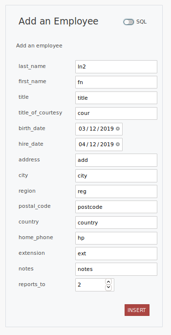
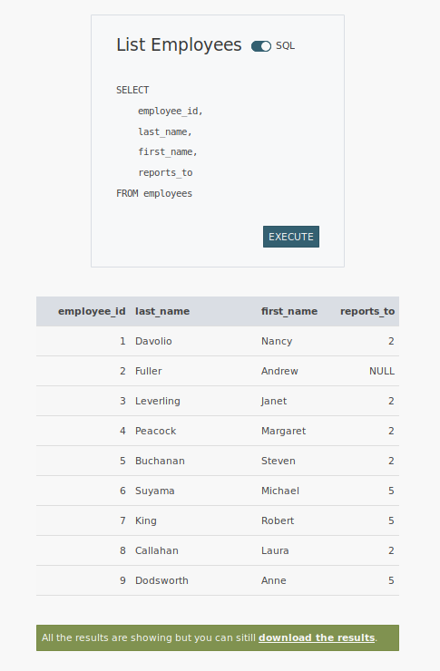
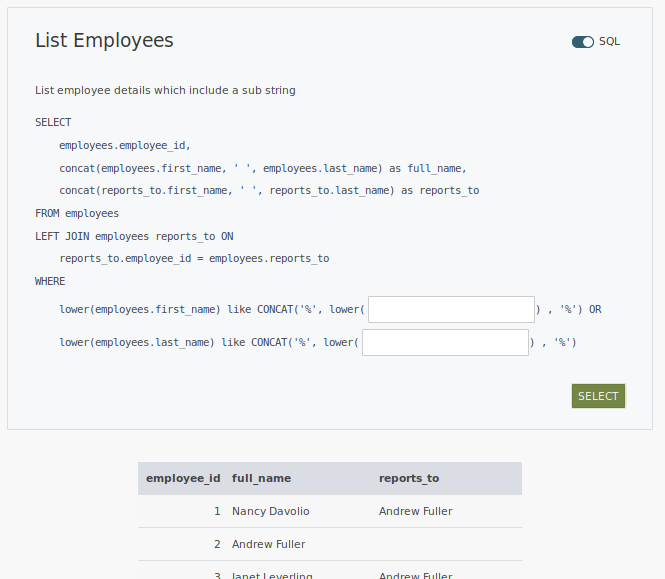
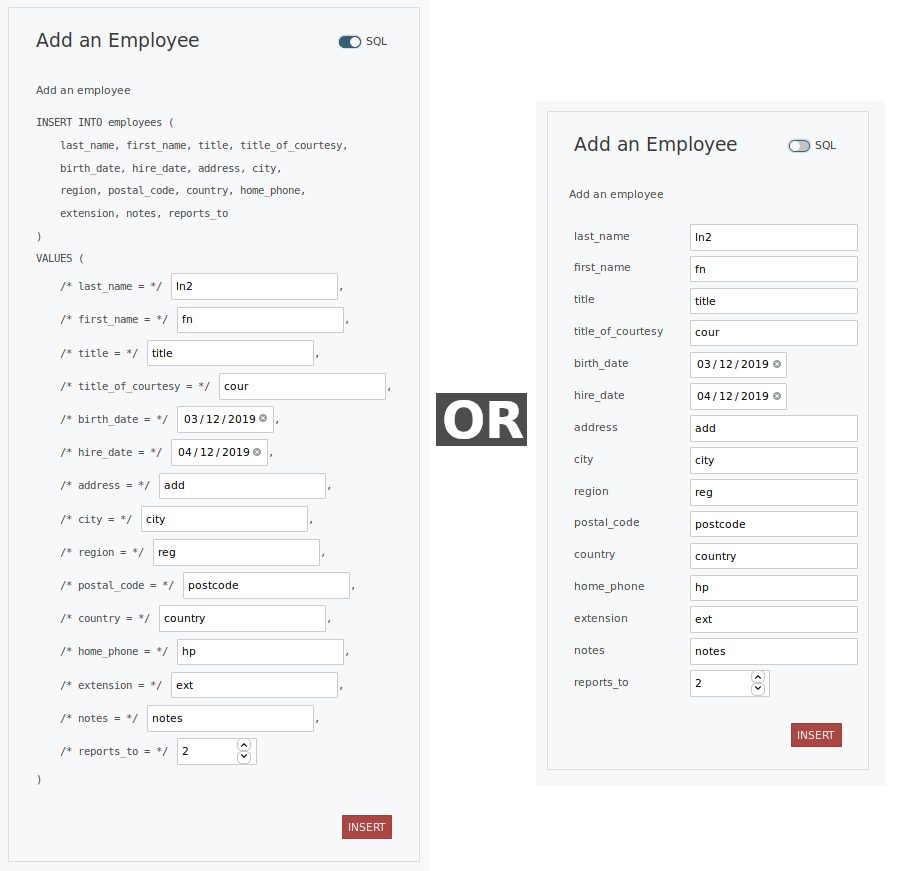
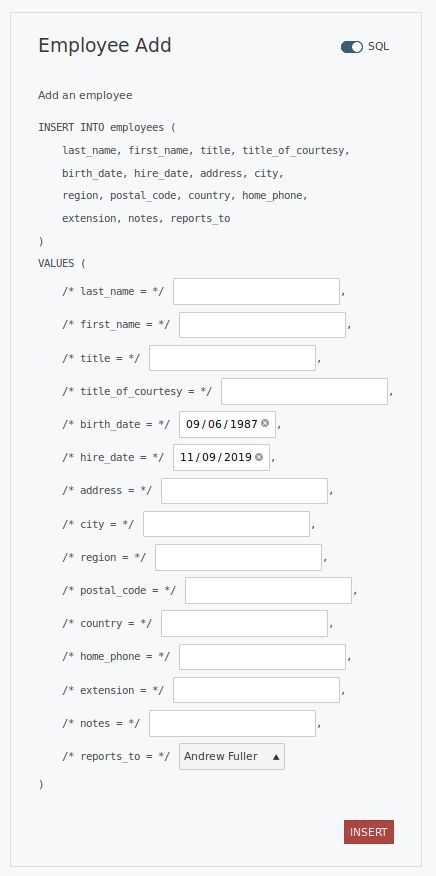
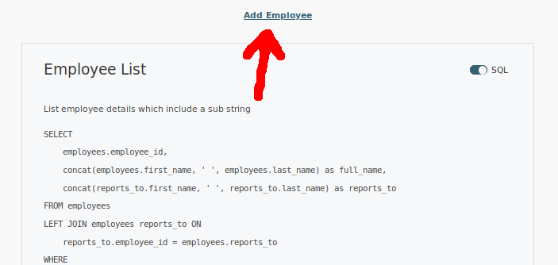

== eSQLate

=== Project Purpose

eSQLate is an attempt to give small teams a quick and easy form of administration panel which is significantly more powerful than CRUD based systems but also as easy to set up.

=== What problem is it solving?

A lot of my work history has been based at small companies with small teams where there is enough resource to build a impressive product using great code, but it is sometimes difficult to justify investing as much time into creating administration panels which nobody other than internal employees will ever see.

There are many times I have had to delve into the database because the narrow range of operations which are available on the administration panels does not cover what I, at that moment, need to do. I don’t think this is always a problem, particularly when the project is at a very early stage but as a project grows having developers or systems administrators log into the database and change settings has some real downsides:

* You’re taking time away from developers / systems administrators to do things which could, sometimes, be done by less technical employees.
* Executing database operations is nearly always a bespoke operation on live data, meaning we have to be really, really careful and think things through in great detail.
* Eventually, everyone will make a mistake, while logged into a live database the unintended effects could be disastrous.

=== What is it?

eSQLate interprets a simple JSON (or JSON5) file like this:

[source,json]
----
{
  "name": "product_search",
  "title": "Product Search",
  "description": "List products that include a substring",
  "parameters": [
    {
      "name": "product_name",
      "type": "string"
    }
  ],
  "statement": "\
    SELECT\n\
      product_id,\n\
      product_name,\n\
      suppliers.company_name as supplier_name,\n\
      unit_price\n\
    FROM products\n\
    LEFT JOIN suppliers on suppliers.supplier_id = products.supplier_id\n\
    WHERE LOWER(product_name) LIKE CONCAT('%', LOWER($product_name), '%')"
}
----

Using the above it will produce a fairly usable and reasonable web interface like what is shown below:

image:./img/simple-json.png[Simple JSON transformed into a fairly usable reasonable web interface]

If users are of a nervous disposition and scared off by seeing things they don’t understand (like SQL) they can flip the toggle to convert the query based interface into a simple form.

We can specify parameters as strings, dates, datetimes, integers, selects, decimals and even use a popup to allow rich selection of a specific parameter:

image:./img/anim.gif[Slideshow of some of the controls available]

Another powerful feature is to provide the user the ability to link these simple JSON documents together together. Doing this giving many possible user journeys allowing basic, but meaningful self-service administration.

image:./img/links.png[You can link documents making lots of user journeys possible]

The result sets can also be downloaded as CSV files.

=== Tutorial - Adding a new workflow

==== The most simple example

About the most simple thing we can do is create a simple select of a table. This can be achieved by writing some simple JSON5 into a file:

===== example_definition/employee_list.json5

[source,javascript]
----
{
    "name": "employee_list",
    "title": "Employee List",
    "parameters": [],
    "statement": "\
        SELECT\n\
            employee_id,\n\
            last_name,\n\
            first_name,\n\
            reports_to\n\
        FROM employees"
}
----

==== The most simple example - Enhanced

Taking the super simple example it is easy to make it marginally useful

===== example_definition/employee_list.json5

[source,javascript]
----
{
    "name": "employee_list",
    "title": "Employee List",
    "description": "List employee details which include a sub string",
    "parameters": [
        {
            "name": "search_string",
            "type": "string",
            "highlight_fields": ["last_name", "first_name"]
        }
    ],
    "statement": "\
        SELECT\n\
            employees.employee_id,\n\
            concat(employees.first_name, ' ', employees.last_name) as full_name,\n\
            concat(reports_to.first_name, ' ', reports_to.last_name) as reports_to\n\
        FROM employees\n\
        LEFT JOIN employees reports_to ON\n\
            reports_to.employee_id = employees.reports_to\n\
        WHERE\n\
            lower(employees.first_name) like CONCAT('%', lower($search_string) , '%') OR\n\
            lower(employees.last_name) like CONCAT('%', lower(${search_string}) , '%')\
        ",
    "statement_type": "SELECT"
}
----

This will find people who’s `first_name` or `last_name` includes `$search_string` anywhere within.

We have:

* Defined a parameter named `search_string` which could also be wrote as `${search_string}` if you need to be unambiguous about where the string terminates
* Added a `statement_type` which really does nothing other than color the button below the query… but it goes a nice red when its a `DELETE`.

How does it look?

==== Allowing adding of employees

Taking what we know from ``The most simple example'' it is trivial to transform it into an `INSERT` statement, however I took the liberty of adding some comments due to the SQL separates column names from the `VALUES`.

===== example_definition/employee_add.json5

[source,javascript]
----
{
    "name": "employee_add",
    "title": "Add an Employee",
    "description": "Add an employee",
    "parameters": [
        { "name": "last_name", "type": "string" },
        { "name": "first_name", "type": "string" },
        { "name": "title", "type": "string" },
        { "name": "title_of_courtesy", "type": "string" },
        { "name": "birth_date", "type": "date" },
        { "name": "hire_date", "type": "date" },
        { "name": "address", "type": "string" },
        { "name": "city", "type": "string" },
        { "name": "region", "type": "string" },
        { "name": "postal_code", "type": "string" },
        { "name": "country", "type": "string" },
        { "name": "home_phone", "type": "string" },
        { "name": "extension", "type": "string" },
        { "name": "notes", "type": "string" },
        { "name": "reports_to", "type": "integer" }
    ],
    "statement": "\
        INSERT INTO employees (\n\
            last_name, first_name, title, title_of_courtesy,\n\
            birth_date, hire_date, address, city,\n\
            region, postal_code, country, home_phone,\n\
            extension, notes, reports_to\n\
        )\n\
        VALUES (\n\
            /* last_name = */ $last_name,\n\
            /* first_name = */ $first_name,\n\
            /* title = */ $title,\n\
            /* title_of_courtesy = */ $title_of_courtesy,\n\
            /* birth_date = */ $birth_date,\n\
            /* hire_date = */ $hire_date,\n\
            /* address = */ $address,\n\
            /* city = */ $city,\n\
            /* region = */ $region,\n\
            /* postal_code = */ $postal_code,\n\
            /* country = */ $country,\n\
            /* home_phone = */ $home_phone,\n\
            /* extension = */ $extension,\n\
            /* notes = */ $notes,\n\
            /* reports_to = */ $reports_to\n\
        )",
    "statement_type": "INSERT"
}
----

The end result looks like the below:

==== Allowing adding of employees - who they report to - enhanced!

I dislike the way a user would have to take note of the user_id that the new employee would report to…

To fix it all we need to do is change `{ "name": "reports_to", "type": "integer" }` into `{ "display_field": "full_name", "definition": "employee_list", "value_field": "employee_id", "type": "popup", "name": "reports_to" }`. The final file is shown below:

Also converting the input of dates to dates is really easy (just change the `"type"`).

===== example_definition/employee_add.json5

[source,javascript]
----
{
    "name": "employee_add",
    "title": "Add an Employee",
    "description": "Add an employee",
    "parameters": [
        { "name": "last_name", "type": "string" },
        { "name": "first_name", "type": "string" },
        { "name": "title", "type": "string" },
        { "name": "title_of_courtesy", "type": "string" },
        { "name": "birth_date", "type": "date" }, /* Changed from "string" to "date" */
        { "name": "hire_date", "type": "date" }, /* Changed from "string" to "date" */
        { "name": "address", "type": "string" },
        { "name": "city", "type": "string" },
        { "name": "region", "type": "string" },
        { "name": "postal_code", "type": "string" },
        { "name": "country", "type": "string" },
        { "name": "home_phone", "type": "string" },
        { "name": "extension", "type": "string" },
        { "name": "notes", "type": "string" },
        {
            "display_field": "full_name", /* Changed from "string" to "popup" */
            "definition": "employee_list",
            "value_field": "employee_id",
            "type": "popup",
            "name": "reports_to"
        }
    ],
    "statement": "\
        INSERT INTO employees (\n\
            last_name, first_name, title, title_of_courtesy,\n\
            birth_date, hire_date, address, city,\n\
            region, postal_code, country, home_phone,\n\
            extension, notes, reports_to\n\
        )\n\
        VALUES (\n\
            /* last_name = */ $last_name,\n\
            /* first_name = */ $first_name,\n\
            /* title = */ $title,\n\
            /* title_of_courtesy = */ $title_of_courtesy,\n\
            /* birth_date = */ $birth_date,\n\
            /* hire_date = */ $hire_date,\n\
            /* address = */ $address,\n\
            /* city = */ $city,\n\
            /* region = */ $region,\n\
            /* postal_code = */ $postal_code,\n\
            /* country = */ $country,\n\
            /* home_phone = */ $home_phone,\n\
            /* extension = */ $extension,\n\
            /* notes = */ $notes,\n\
            /* reports_to = */ $reports_to\n\
        )",
    "statement_type": "INSERT"
}
----

The end result is that there will be a new control shown which when clicked will open a pop-up:

==== Adding Links

The definitions we’ve defined so far do not have to be completely independent. It is possible to define links both on each row of the result set and above/below of the definition / form itself.

Lets first add a link from the Employee List to Employee Add. We can do this in three ways to a definition:

===== 1. We can add to `"links"`

Links are displayed between the definition and the results:

[source,javascript]
----
"links": [
  { "href": "#employee_add", "text": "Add an employee" }
]
----

image:./img/links.png[Links]

===== 2. We can add to `"top_links"`, which are identical to `"links"` except that they occur above the displayed definition

Links are displayed above the definition:

[source,javascript]
----
"top_links": [
  { "href": "#employee_add", "text": "Add an employee" }
]
----

===== 3. We can add to `"row_links"`

This will add a row on every line of the results table. This is useful if the row denotes some information you want to use in the place which you are linking to. To do this add the following to the root of the definition:

[source,javascript]
----
"row_links": [
  { "href": "#employee_add?reports_to=${popup employee_id full_name}", "text": "Add Subordinate for ${full_name}" }
]
----

image:./img/row_links.png[Links on a row]

==== Hiding the ``Employee Add'' Menu Item

If you wish to hide the ``Employee Add'' menu item it is simple enough. Just change the name (and filename) from `employee_add.json5` to `_employee_add.json5`. Beware any links that exist will also need to updated.

=== Installation

==== Desktop Method

If you have a PostgreSQL server and want to run it on your local laptop you may choose to use the desktop method.

This will has the nicety of automagically picking port numbers and opening the browser once everything has started up.

* Clone this repository with https://github.com/forbesmyester/esqlate[eSQLate] with `git clone https://github.com/forbesmyester/esqlate.git`.
* Set up a PostgreSQL server and get the hostname, port, username and password.
* Change into the directory you checked out the code into with `cd esqlate`
* Run `./esqlate`.

==== Docker Compose Method

If you’re just trying eSQLate out the most simple way to test it out is to use https://github.com/docker/compose[Docker Compose].

If you check out this repository you’ll see a docker-compose.yml file. In the directory you checked it out to all you’ll have to do is:

* Clone https://github.com/forbesmyester/esqlate-server[eSQLate Server] with `[ ! -d "esqlate-server" ] && git clone git@github.com:forbesmyester/esqlate-server.git esqlate-server`.
* Clone https://github.com/forbesmyester/esqlate-front[eSQLate Front] with `[ ! -d "esqlate-front" ] && git clone git@github.com:forbesmyester/esqlate-front.git esqlate-front`.
* Bring up the services using `docker-compose build && docker-compose up`.
* Customize the docker-compose.yml to meet your needs.

==== Directly on VM/Metal Method

Installation is relatively simple. All you need to do is install:

* https://www.postgresql.org/[PostgreSQL] The most awesome SQL database.
* https://github.com/forbesmyester/esqlate-server[eSQLate Server] Which is provides the API functions and does the actual database queries.
* https://github.com/forbesmyester/esqlate-front[eSQLate Front] talks to eSQLate Server and provides a web based interface to the user.

=== Running the Integration Tests

There are some basic integration tests that run using http://www.cypress.io[Cyress]. To run them first bring up testing docker compose and then run the tests:

[source,bash]
----
docker-compose -f ./docker-compose-integration.yml up
----

=== What still needs to be done?

* SERVER: Currently results persisted to the local disk. I plan to add an AWS S3 persistence option.
* SERVER: Support other types of databases.
