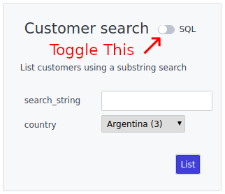
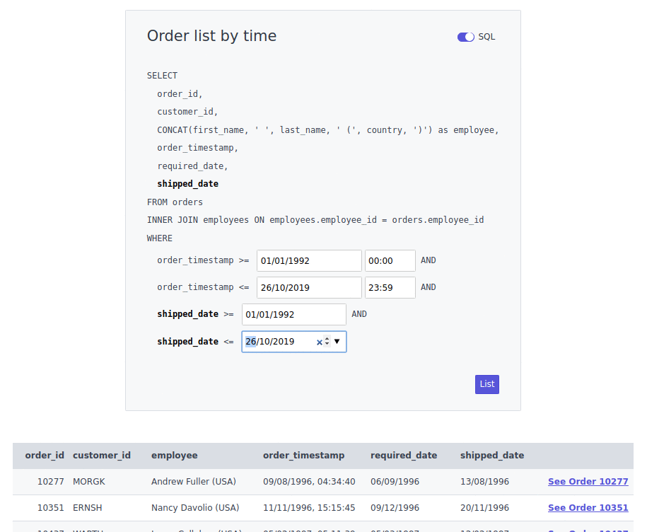
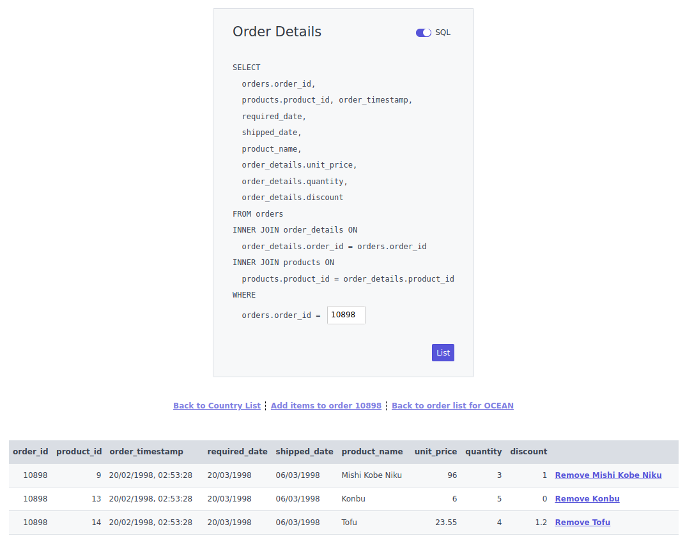

# eSQLate

## Project Purpose

eSQLate is an attempt to give small teams a quick and easy form of administration panel which is significantly more powerful than CRUD based systems but also as easy to set up.

## What problem is it solving?

A lot of my work history has been based at small companies companies with small teams where there is enough resource to build a impressive product using great code, but it is sometimes difficult to justify investing as much time into creating administration panels which nobody other than internal employees will ever see.

There are many times I have had to delve into the database because the narrow range of operations which are available on the administration panels does not cover what I, at that moment, need to do.  I don't think this is always a problem, particularly when the project is at a very early stage but as a project grows having developers or systems administrators log into the database and change settings has some real downsides:

 * You're taking time away from developers / systems administrators to do things which could, sometimes, be done by less technical employees.
 * Executing database operations is nearly always a bespoke operation on live data, meaning we have to be really, really careful and think things through in great detail.
 * Eventually, everyone will make a mistake, while logged into a live database the unintended effects could be disastrous.

## What is it?

eSQLate interprets a simple JSON (or JSON5) file like this:

```json
{
  "name": "product_search",
  "title": "Product Search",
  "description": "List products that include a substring",
  "parameters": [
    {
      "name": "product_name",
      "type": "string"
    }
  ],
  "statement": "\
    SELECT\n\
      product_id,\n\
      product_name,\n\
      suppliers.company_name as supplier_name,\n\
      unit_price\n\
    FROM products\n\
    LEFT JOIN suppliers on suppliers.supplier_id = products.supplier_id\n\
    WHERE LOWER(product_name) LIKE CONCAT('%', LOWER($product_name), '%')"
}
```

Using the above it will produce a fairly usable and reasonable web interface like what is shown below:


If users are of a nervous disposition and scared off by seeing things they don't understand (like SQL) they can flip the toggle to convert the query based interface into a simple form.



We can specify parameters as strings, dates, datetimes, integers, selects, decimals and even use a popup to allow rich selection of a specific parameter:



Another powerful feature is to provide the user the ability to link these simple JSON documents together together. Doing this giving many possible user journeys allowing basic, but meaningful self-service administration.



The result sets can also be downloaded as CSV files.

## Installation

### Docker Compose Method

If you're just trying eSQLate out the most simple way to test it out is to use [Docker Compose](https://github.com/docker/compose).

In the root of this repository you'll see a [docker-compose.yml](docker-compose.yml) file. To use this all you'll have to do is:

 1) Checkout [eSQLate Server](../esqlate-server) with `[ ! -d "esqlate-server" ] && git clone git@github.com:forbesmyester/esqlate-server.git esqlate-server`.
 2) Checkout [eSQLate Front](../esqlate-front) with `[ ! -d "esqlate-front" ] && git clone git@github.com:forbesmyester/esqlate-front.git esqlate-front`.
 3) Bring up the services using `docker-compose build && docker-compose up`.
 4) Customize the docker-compose.yml to meet your needs.

### Directly on VM/Metal Method

Installation is relatively simple. All you need to do is install:

 * [PostgreSQL](https://www.postgresql.org/) The most awesome SQL database.
 * [eSQLate Server](../esqlate-server) Which is provides the API functions and does the actual database queries.
 * [eSQLate Front](../esqlate-front) talks to eSQLate Server and provides a web based interface to the user.

## What still needs to be done?

 * SERVER: Allow nullable fields
 * LIB: Allow nullable fields
 * FRONT: Allow nullable fields
 * SERVER: Currently results persisted to the local disk. I plan to add an AWS S3 persistence option.
 * SERVER: Support other types of databases.
 * FRONT: ~~Some way to support the creation of the double encoding for `row_links`.~~
 * FRONT_END: ~~Persist the SQL toggle.~~
 * PROJECT: ~~Setup a docker-compose.yml file.~~
 * SERVER: ~~We should probably be able to delete persisted files from the local disk (or AWS S3 in future) when they get to a certain age. This may be a separate process.~~
 * SERVER: ~~Currently the server writes one result file which is a JSON document, which could conceivably be huge. This should probably include only the first n rows and the full data set be stored as a downloadable CSV.~~
